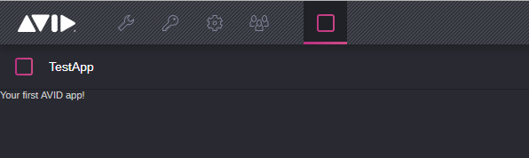
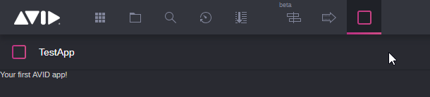

# Example Admin App

### Introduction

This example show how can you develope CloudUx Application that it will be
available from Adming page.

### Admin mode
To use your application as Admin you need to change mode in **package.json**
as said in [guide](http://developer.avid.com/mcux_ui_plugin/clux-api/apps/apps-types.html#user-and-administrative-applications/ "Avid Developers").
In test application it looks like this:

Beacuse we run application only for admin we wouldn't be able to see it
from main view:

But it would be available in your admin panel `https://CloudUxAddress/admin`

### Main mode
If you want to change your application view to main page in your **package.json**
change mode to **main**:

Now your application will be visible in main view:

But it won't be available in your admin view:

### Running the example

To run example you will need running MediaCentral CloudUX server. properties
can we changed in `src/project.act`. After you change `project.act` in your
cli type:
1. `npm install`
2. `npm start`