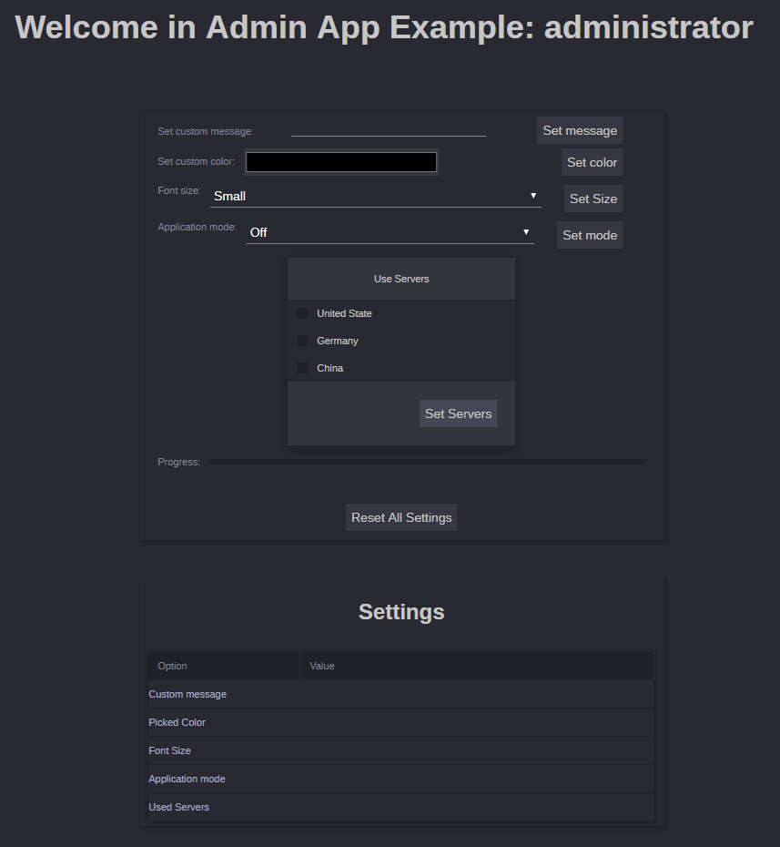
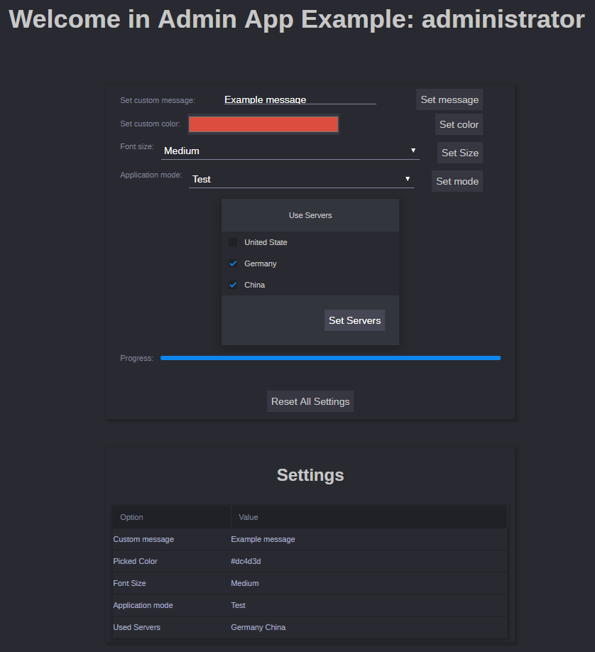

# Example Admin App

## Introduction

This example show you example Application that can be only seen from
Admin View in Avid **MediaCentral | Cloud UX**.

## Admin App
This example allow you to see how Application work in admin view.
You will be able to set some settings using **avid.acs.attributes**

When you open **MediaCentral | Cloud UX** in Admin-View open application

In it you will see example application. If someone used it before,
those settings may not be empy.

After you fill all of the fields you can see settings that you chose on
bottom.

You can clear all of settings by clicking on **Reset All Settings**

## Running the example

To run example you will need Avid MediaCentral | Cloud UX server.
 Connection roperties can be changed in [src/project.config.json](src/project.config.json "project.config.json").
After you change hostIp in `project.act` you can run application. You may also need
to change REALM and VERSION in [src/app/constants.js](src/app/constants.js "Project constants")

**from Admin-App folder in cli type:**
1. `npm install`
2. `npm start`
3. Go to [localhost/admin-login](https://localhost/admin-login "localhost").

